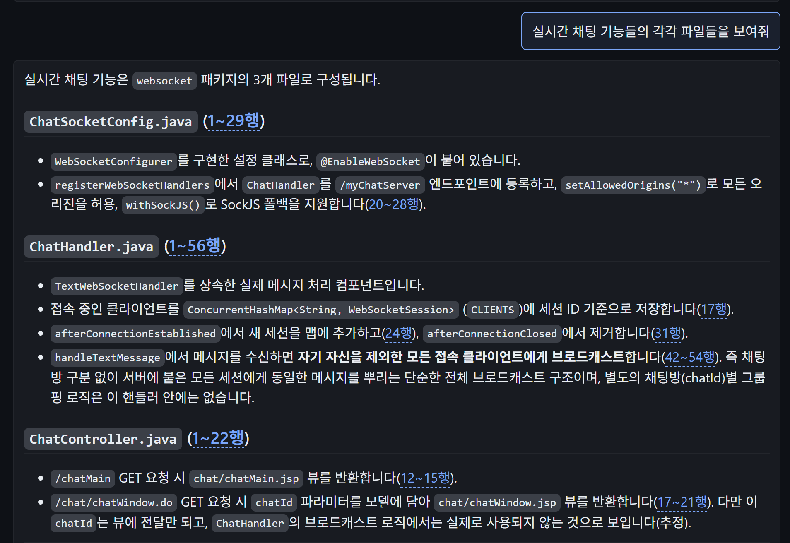
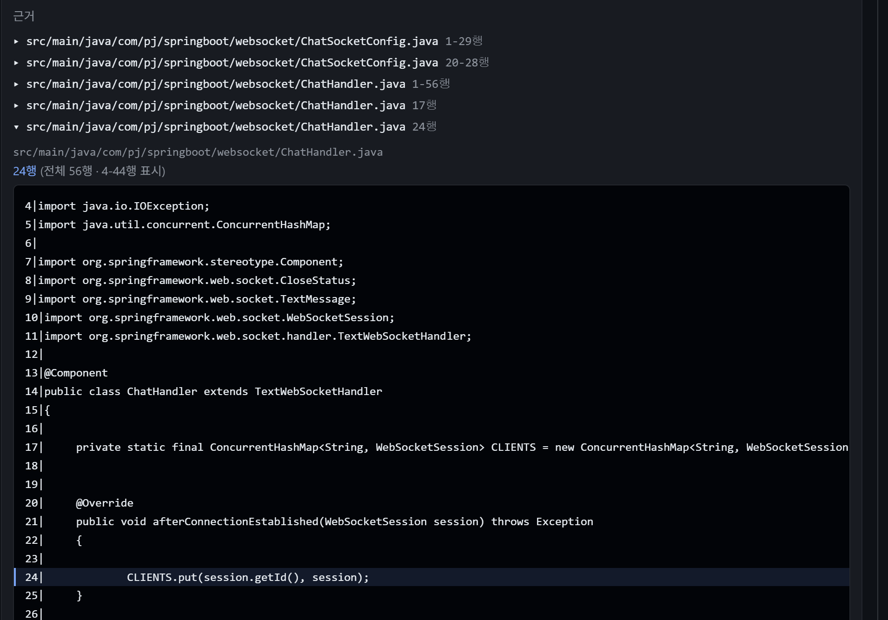
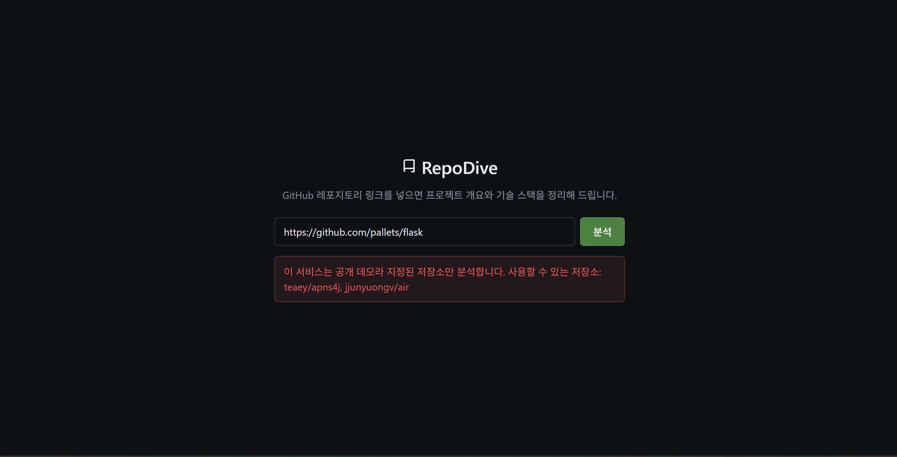

# RepoDive

GitHub 저장소 주소를 넣으면 코드를 읽어 구조와 기술스택을 요약하고, 이어서 질문에 답한다.
답변의 근거는 **파일명과 행 번호로 인용**되고, 인용은 화면에서 실제 코드로 펼쳐진다.
큰 저장소는 모델이 `search_code`·`read_file`·`grep` 을 직접 부르고, 작은 저장소는 소스 전체를
프롬프트에 넣는다 — **둘 중 어느 쪽이 나은지는 재서 정했다. 그 절차가 이 프로젝트의 내용이다.**



*`jjunyuongv/air` 에 "실시간 채팅 기능들의 각각 파일들을 보여줘" 라고 물은 결과.
답변이 `ChatSocketConfig.java`·`ChatHandler.java`·`ChatController.java` 를 짚고,
행 표기(`1~29행`·`24행`·`42~54행` …)마다 링크가 걸려 있다.*



*'근거' 목록에서 `ChatHandler.java 24행` 을 펼친 것. 그 행을 하이라이트하고 앞뒤로
20행씩(`CITATION_CONTEXT_LINES`) 붙여 4-44행을 보여준다 — **서버는 인용이 맞았는지
판정하지 않는다.** 코드를 그대로 펼쳐 두고 맞았는지는 사람이 본다.*



*공개 데모는 `ALLOWED_REPOS` 로 **로그인하지 않은 사람이 넣을 수 있는 저장소**를 제한한다.
`pallets/flask` 를 넣으면 분석하지 않고 쓸 수 있는 저장소(`teaey/apns4j`·`jjunyuongv/air`)를
알려준다 — 남용 상한이 서비스 전체 합산이라 한 명이 나머지를 막을 수 있다.
로그인하면 공개 저장소는 무엇이든 넣을 수 있다(비공개는 서버 토큰으로 읽어서 안 열린다).
로그인한 사람의 첫 화면에는 자기 공개 저장소 목록이 뜨고, 눌러서 바로 분석을 시작할 수 있다.
**위 화면은 로그인이 꺼진 배포의 것이라 그 안내가 안 붙는다.***

## 실측

| 무엇 | 값 | 어떻게 쟀나 |
|---|---|---|
| 인용 정확도 (air) | **0.7647 → 1.0** | 같은 실행에서 RAG 팔과 도구 팔을 나란히 돌렸다. 질의가 17개라 한 건이 0.0588 — **+0.235 는 4건분**이라 노이즈와 갈린다 |
| 질문당 비용 (air) | **$0.009141 → $0.016109 (1.76배)** | 같은 측정의 토큰 기록. 상한 3.0배(`COST_RATIO_LIMIT`)는 **측정 전에** docstring 에 박아 두었다 |
| 인용 추출 · 유실 | **535 → 814** · **358 → 79** | 저장된 답변 8기록에 옛 파서와 새 파서를 각각 돌려 건별로 대조(경로 경계 수정까지 포함). LLM 호출 0회 |
| 경로 해석 실패 | **171 → 0** | 위와 같은 대조. 새로 만든 잘못된 링크 0건, 전에 맞던 것이 틀리게 된 건 0건 |
| 행 번호 정확도 | **71.1% (165/232)** | 인용이 가리킨 행과 보관 원문을 대조. 경계 수정으로 판정불가 3건이 정확으로 옮겨졌고 **틀림 67건은 그대로다**. **서버는 이걸 고쳐 주지 않는다** — 틀린 것을 감추면 고칠 수가 없다 |
| 테스트 | **587건** (무과금 448 + DB 통합 139) | `pytest -q` 의 기본 실행 대상. 과금·측정 14건은 `-m evaluation`·`-m billed` 로만 돈다. DB 통합 139건은 Postgres 가 있어야 돌고 없으면 skip 한다 |
| ruff (E9,F) | **0건** | `ruff check --select E9,F app tests scripts` |

측정에 쓴 세트는 셋이다. `Back/tests/search_eval_dataset.py` 의 `EVAL_SETS` 에 그대로 있다.

| 세트 | 저장소 | 성격 | 번들 토큰 | 팔 |
|---|---|---|---|---|
| air | `jjunyuongv/air` | 큰 Java 웹앱 | 62,380 | rag · tool |
| marryday | `jjunyuongv/marryday` | 큰 Python/JS 웹앱 | 1,057,764 | rag · tool |
| apns4j | `teaey/apns4j` | 작은 Java 라이브러리 | 34,467 | rag · full · tool |

**팔은 저장소 이름이 아니라 이 번들 토큰 실측으로 갈렸다** — 임계값
`FULL_INJECTION_MAX_TOKENS`(57,000) 이하일 때만 `full` 팔이 붙는다. 프로덕션이 우회를
판정할 때 쓰는 바로 그 함수라, 임계값을 바꾸면 하네스가 저절로 따라간다.

숫자의 출처는 전부 [`docs/log/`](docs/log/) 와 [STATUS.md](STATUS.md) 에 있다.
인용·비용은 [07-answer-quality.md](docs/log/07-answer-quality.md), 파서 수치는
[10-citation-paths.md](docs/log/10-citation-paths.md)(저장된 답변에서 다시 뽑아 같은 값이 나온 기록은
[13-status-review.md](docs/log/13-status-review.md)), 테스트 건수는 [15-repo-list.md](docs/log/15-repo-list.md).

## 판정 절차 — 자를 먼저 만든다

```
0단계  자를 만든다        인용 정확도만으로는 "지어냄"과 "침묵"이 똑같이 0점이다
  │                       → 저장소에 없는 것을 묻는 거절 질의 18개로 축을 따로 세웠다
  │
  ├─ 변이로 자를 검증      변이 4건을 실제로 넣어 테스트가 깨지는지 봤다
  │                       (원본은 워킹트리 사본을 떠 두고 sha256 으로 복원 대조)
  │
  ├─ 기준을 고정          A 인용 → B 거절 → C 비용 3.0배. **측정 전에** docstring 에 박았다
  │                       결과를 보고 정하면 측정이 아니라 사후 합리화가 된다
  │
1단계  잰다               156 호출 · 26분 42초 · 실비 $2.1259
  └─ 그 기준을 그대로 적용 A 통과 · B 동률 · C 는 상한의 절반 아래 → 큰 저장소에만 도입
```

**0단계에서 세운 것이 1·2단계에서 그대로 돌았다는 것이 이 절차의 값이다.**

- **기준이 먼저 있었기 때문에 진 결과도 그대로 적었다.** apns4j 에서는 도구 팔이 전체
  주입에 졌고(1.0 vs 0.9375), 기준 A 가 "떨어지면 기각"이므로 그대로 기각했다.
  그래서 도구는 임계값을 넘는 저장소에서만 켜진다
- **표본의 한계도 같은 기준으로 적었다.** marryday 는 +0.0625, 곧 **한 건이라 노이즈와
  구분되지 않는다.** 판정을 받친 근거로 세지 않았다 — air 와 같은 코드 경로이므로
  판정을 뒤집지도 않았을 뿐이다
- **답변 원문을 남겨 두었다.** 거절 채점기가 두 번 연속 샜을 때 156건을 **API 호출 0회 · $0**
  으로 다시 채점했다. 두 번 다 날조는 0건이었고 전부 자의 문제였다

## 되돌린 결정

무엇을 안 했는가가 무엇을 했는가만큼 말해 준다. 넷 다 되돌린 이유가 로그에 남아 있다.

- **임베딩 배치 크기** — 마이크로벤치에서 1이 32보다 2.2배 빨랐는데 실제 재색인 3회에서
  결론이 세 번 뒤집혔다. 원인은 배치가 아니라 CPU 점유였다 →
  [05](docs/log/05-tasks-a-b.md)
- **도메인 용어 사전 자동 생성 (STEP 3a)** — 못 찾던 2개는 좋아졌지만 잘 찾던 4개가
  나빠져 전부 제거했다 → [02](docs/log/02-stage3.md)
- **Anthropic Admin API 실청구 집계** — 조직 계정이 필요해 개인 계정에서 못 쓴다.
  비용은 단가 기반 추정치다 → [01](docs/log/01-stage1-2.md)
- **클래스명 → 파일 매핑** — Java 는 첫 타입명 == 파일명이 72/72 로 관례가 확실했다.
  그런데 air 답변에서 **틀린 링크가 실증됐다** — 한 줄에 유일하게 매핑되는 심볼이
  `ChatHandler` 인데 그 줄이 말하는 파일은 `ChatSocketConfig.java` 였다.
  내용이 그럴듯해서 더 알아채기 어렵다 → [10](docs/log/10-citation-paths.md)

## 아키텍처

```
브라우저 ── nginx :80 ─┬─ /                    정적 파일 (React · Vite)
                       └─ /analyze /chat ──→ FastAPI :8000 ──→ Postgres + pgvector

POST /analyze   URL 파싱 → 접근 확인 → 요약 캐시 → (미스면) 수집 → 정적분석 → LLM 요약
                └ 응답 직전 색인을 큐에 넣고 **기다리지 않는다**
                     └ [워커 1개] 청킹 → 임베딩(로컬 ONNX · 과금 없음) → pgvector
                                        + 소스 원문을 스냅샷 단위로 보관

POST /chat      세션 → 남용 제한 → 근거 확보 ─┬ 소스 번들 있음 → 검색 안 함(전체 주입)
                                              ├ 색인 완료      → 도구를 모델이 직접 부른다
                                              └ 색인 중        → 요약만으로 답한다(막지 않는다)
                └ 답변에서 인용을 뽑아 보관 원문의 행 범위로 링크한다
```

- **캐시 브레이크포인트는 2개** — system 과 첫 사용자 메시지. 도구 왕복은 그 뒤에 쌓이므로
  접두사가 깨지지 않는다. 검색 스니펫을 미리 넣으면 왕복마다 정가로 다시 청구된다
- **큐 하나 · 워커 하나.** 임베딩이 CPU 를 다 쓴다
- **빌드를 쌓고 포인터를 옮긴다.** 재색인 중에도 옛 색인으로 계속 답한다

## 로컬 실행

```bash
cp .env.prod.example .env.prod        # ANTHROPIC_API_KEY 와 POSTGRES_PASSWORD 를 채운다
docker compose --env-file .env.prod -f docker-compose.prod.yml up -d --build --force-recreate
```

→ http://localhost . nginx · backend · db 셋이 뜨고 밖으로 여는 포트는 80 하나다.
**`--force-recreate` 가 필수다** — `--build` 만 하면 옛 컨테이너가 계속 돌아도
빌드 로그와 healthcheck 가 둘 다 정상이라 알아챌 신호가 없다.

개발 중에는 DB 만 컨테이너로 띄운다. 볼륨이 갈려 있어 운영 스택과 동시에 켜도 섞이지 않는다.

```bash
docker compose -f Back/docker-compose.yml up -d
cd Back && uvicorn app.main:app --reload      # Back/.env 필요
cd Front && npm run dev
```

## 문서

**코드를 고치기 전에 [STATUS.md](STATUS.md) 를 읽는다** — 지금 유효한 상수·전제·폐기된 결정이
거기 있고, §1 표는 테스트가 코드와 대조한다. [`docs/log/`](docs/log/) 는 시간순이라 뒤집힌
결론이 그대로 남아 있으므로 근거가 필요할 때만 연다([plan.md](plan.md) 가 그 색인).
겪은 문제를 증상으로 찾을 때는 [TROUBLESHOOTING.md](TROUBLESHOOTING.md).
