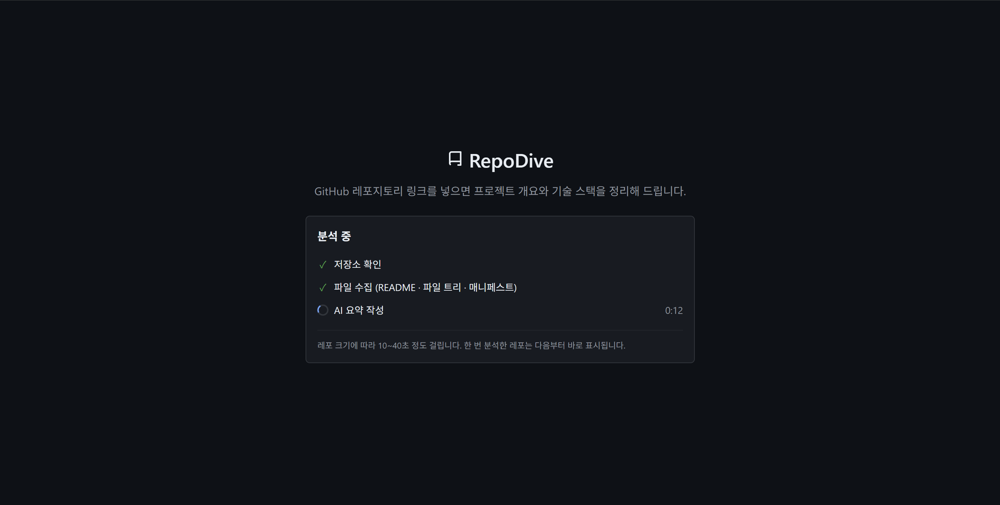
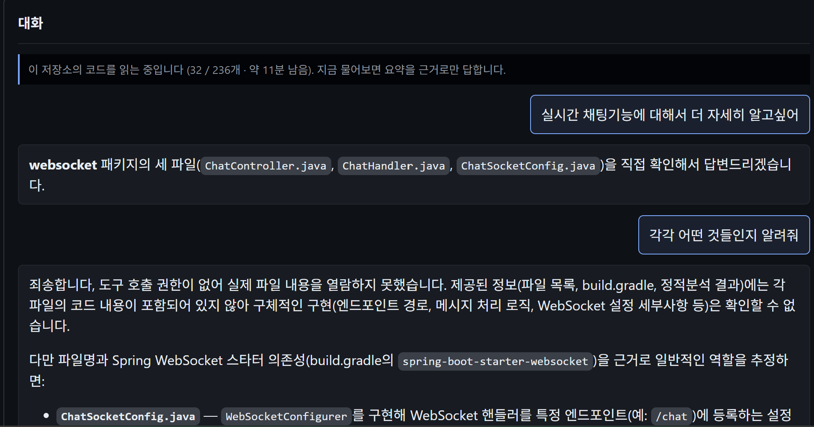

# 09 — 배포

> **머리말.** 배포 준비 작업의 로그다. 컨테이너 이미지·오케스트레이션이 여기 들어간다.
> "지금 값이 무엇인가"는 [STATUS.md](../../STATUS.md) 를 본다.

<!-- BODY -->

## 1단계 — 백엔드 Dockerfile (2026-08-25)

브랜치 `feat/docker`. **이번 단계는 백엔드 이미지 하나다** — compose 도 배포도 하지 않았다.

### 계획

1. Python 3.12 + JVM(PMD) + Node(oxlint) 를 한 이미지에 → 검증: 컨테이너 안에서 네 린터가 실제로 돈다
2. 임베딩 모델을 빌드 시점에 굽기 → 검증: 네트워크를 끊고(`HF_HUB_OFFLINE=1`) 벡터가 나오고 **차원이 1024**
3. `.dockerignore` 로 `Back/cache/` 제외 → 검증: 컨텍스트 전송량이 GB 단위가 아니다
4. 무거운 다운로드를 코드 COPY 앞으로 → 검증: 레이어 순서
5. `.env` 는 굽지 않는다 → 검증: 이미지 안에 `/app/.env` 가 없고 `ANTHROPIC_API_KEY` 가 빈 값

### 만든 것

- `Back/Dockerfile`
- `.dockerignore` (저장소 루트. **컨텍스트가 루트다** — `docker build -f Back/Dockerfile .`)

### 왜 런타임이 셋인가

정적분석기가 넷인데 런타임이 셋이다. `ruff` 는 pip, `oxlint`·`stylelint` 는 Node,
`PMD` 는 JVM. **하나라도 빠지면 그 언어의 정적분석만 조용히 사라진다**
(`_run_*` 이 도구를 못 찾으면 `None` 을 돌려주고 로그 한 줄만 남긴다).
그래서 "이미지가 떴다"로는 검증이 안 되고, 네 개를 각각 태워 봐야 한다.

### 임베딩 모델을 굽는 자리

**fastembed 는 import 때가 아니라 첫 `embed()` 때 가중치를 받는다.** 그래서
`RUN python -c "... embed_query(...)"` 로 한 번 태워야 `cache/models/` 에 떨어진다.

그 앞에 **환경변수 7개를 `.env` 와 같게 박았다.** 기본값은 jina-code(768)인데 운영은
e5-large 계열(1024)이라, 기본값으로 구우면 **다른 모델이 들어가고 기존 색인과 벡터가 안 맞는다.**
`ENV` 로 박는 이유는 굽는 시점만이 아니라 **런타임도 같아야** 하기 때문이다 —
런타임이 기본값으로 돌면 이미지 안의 가중치를 두고 다시 받는다.
(비밀이 아니므로 `.env` 금지 규칙에 걸리지 않는다. 런타임에 덮을 수도 있다)

같은 `RUN` 에서 `len(v) == EMBEDDING_DIM` 을 단언한다. **768 이 나오면 빌드가 깨진다** —
잘못 구워진 이미지가 조용히 나가는 것보다 낫다.

굽는 데 필요한 파일은 `app/config.py`·`app/core/embeddings.py` **둘뿐**이라 그 둘만 먼저 COPY 한다.
앱을 통째로 앞당기면 라우터 한 줄 고칠 때마다 이 레이어가 깨져 650MB 를 다시 받는다.
반대로 이 둘이 바뀌면 다시 굽는 것이 맞다 — 모델 이름·차원·등록 방식이 거기 있다.

**등록 로직을 Dockerfile 에 복사하지 않았다.** `add_custom_model` 의 pooling·정규화를
베끼면 `embeddings.py` 와 갈라지고, 갈라져도 오류가 안 난다(캐시는 저장소 이름과 파일명으로만
결정된다). 실제 코드 경로를 그대로 태우면 그 위험이 없다.

### 레이어 순서

pip → npm → PMD → 모델 → **코드**. 앞의 넷이 합쳐 690MB 를 받는데, 코드 뒤에 두면
한 줄 고칠 때마다 그걸 다시 받는다.

### libgomp1 을 넣었다가 뺐다

`python:3.12-slim-bookworm` 에 `libgomp` 가 없어서(실측) onnxruntime 이 죽을 것이라 보고
넣었다. **확인해 보니 링크하는 것이 하나도 없었다** — site-packages 의 `.so` 를 전부
`ldd` 로 훑어 libgomp 를 찾는 것이 0개였고, 빼고 재빌드해도 임베딩이 그대로 돌았다.

*"slim 에 없다"와 "그래서 필요하다"는 다른 명제다.* 짐작으로 넣은 패키지는 주석까지
틀리게 만든다("없으면 죽는다"고 적어 뒀었다).

### Node 를 apt 로 받지 않은 이유

bookworm 의 `nodejs` 는 **18.20.4** 인데 `package.json` 의 두 도구가 그보다 높은 것을 요구한다
(실측: stylelint `>=20.19.0`, oxlint `^20.19.0 || >=22.12.0`). NodeSource 저장소를 붙이는
대신 공식 `node:22-bookworm-slim` 에서 `node` 바이너리와 `node_modules` 를 COPY 했다.

### 검증 결과 (로컬 Docker Desktop 28.3.2)

| 항목 | 결과 |
|---|---|
| 임베딩 모델 | `cache/models/models--intfloat--multilingual-e5-large` 553MB. `HF_HUB_OFFLINE=1` 로 로드해 질의·문서 벡터 **둘 다 dim=1024**, 입력 한도 512 |
| 임베딩 설정 7개 | 런타임 `config` 값이 `.env` 와 일치. **접두어 끝 공백도 보존**(`'query: '`·`'passage: '`) |
| PMD | `pmd-bin-7.26.0`, OpenJDK 17.0.20 위에서 샘플 Java 검사 → `EmptyCatchBlock` 검출 |
| oxlint | 1.79.0, Node 22.23.2 |
| 네 린터 동시 | `static_analysis.analyze()` 로 ruff 2건 · oxlint 2건 · pmd 2건 · stylelint 0건. **`find_tool`/`find_pmd` 가 넷 다 찾는다** |
| `.env` | 이미지에 없음. `ANTHROPIC_API_KEY` 빈 값 |
| 기동 | DB 없이 `/health` → `{"status":"ok"}` (문서대로 DB 기능만 꺼진다) |
| 이미지 크기 | **2.39GB** — site-packages 308MB · JVM 184MB · 모델 553MB · PMD 78MB · node_modules 52MB |

### 남겨 둔 것

- **root 로 돈다.** 비-root 사용자를 넣지 않았다. 린터 셋이 남의 코드를 실행하지 않도록
  고른 것들이라(§정적분석) 급하지는 않지만, 배포 전에 볼 것
- `HEALTHCHECK` 없음 — compose 단계에서 넣는 편이 낫다
- `Back/tests/` 는 `.dockerignore` 로 뺐다. 이미지 안에서 `pytest` 를 돌릴 수 없다

## 2단계 — 프론트 Nginx 이미지 + 리버스 프록시 (2026-08-25)

브랜치 `feat/docker`. **프론트 이미지와 nginx 설정까지다** — compose(3단계)도 HTTPS·도메인(7단계)도 아직이다.

목표 구성은 입구를 하나로 모으는 것이다:

```
브라우저 → nginx :80
             ├ /                                  → 정적 파일 (Vite 빌드 결과)
             └ /analyze · /chat · /admin · /health → backend:8000
```

같은 출처에서 나가므로 **브라우저에 CORS 가 없다.** preflight 도 없다.

### 계획

1. 멀티스테이지 Dockerfile → 검증: 최종 이미지에 `node_modules` 가 없다
2. `VITE_API_BASE=""` 로 빌드 → 검증: 번들에 `127.0.0.1:8000` 문자열이 **없다**
3. nginx.conf (SPA 폴백 · 프록시 · 타임아웃 · 캐시 헤더) → 검증: 두 컨테이너를 같은 네트워크에 올려 브라우저로 확인
4. CORS 미들웨어는 **지우지 않는다** → 검증: 로컬 개발(:5173)이 그대로 남는지
5. 이미지 크기 보고

### 만든 것

- `Front/Dockerfile`
- `Front/nginx.conf`
- `Front/.dockerignore` — **컨텍스트가 `Front/` 다.** 저장소 루트의 `.dockerignore` 는
  루트를 컨텍스트로 쓰는 백엔드 빌드의 것이고, dockerignore 는 **컨텍스트 루트에서만** 읽힌다.
  백엔드는 `docker build -f Back/Dockerfile .`, 프론트는 `docker build -f Front/Dockerfile Front` 로
  컨텍스트가 서로 다르다

### `??` 를 확인했다 — 빈 문자열은 폴백하지 않는다

`api.ts:3` 이 `import.meta.env.VITE_API_BASE ?? "http://127.0.0.1:8000"` 이다.
`??` 는 **null·undefined 에만** 폴백하므로 빈 문자열은 그대로 남고, `fetch` 가 상대 경로로 나간다.
(`||` 였다면 빈 문자열이 폴백을 타서 브라우저가 `127.0.0.1:8000` 을 직접 불렀을 것이고,
컨테이너에서 그 주소는 백엔드가 아니라 **브라우저가 도는 호스트**를 가리킨다)

**다만 `""` 와 "정의 안 됨"은 다르다.** 값이 아예 없으면 `undefined` 가 되어 폴백을 탄다.
그래서 "ENV 를 박았다"는 검증이 아니고, **구운 번들에 그 문자열이 없는지**가 검증이다.
실측: 번들의 fetch 가 `` fetch(`/analyze`) ``·`` fetch(`/chat/${e}/file?${n}`) `` 로 나가고
`127.0.0.1` 은 0건. 해시도 갈렸다(`index-D6OOfPtw.js` → `index-B0SmlxLX.js`).

### 프록시 경로는 `main.py` 를 보고 적었다

추측하지 않았다. `include_router` 넷이 실제로 여는 것:

| 라우터 | 경로 |
|---|---|
| `health.router` | `/health` |
| `analyze.router` | `/analyze` |
| `chat.router` | `/chat` · `/chat/{id}` · `/chat/{id}/file` · `/chat/{id}/index` |
| `admin.router` | `/admin` · `/admin/{페이지}` · `/admin/api/*` · `/admin/admin.css` |

정규식 하나(`^/(analyze|chat|admin|health)(/|$)`)로 묶었다. `(/|$)` 로 경계를 박은 것이 핵심이다 —
없으면 `/chatbot` 같은 프론트 경로가 백엔드로 샌다(실측으로 확인: `/chatbot` → SPA 200).

**`admin.root_router` 의 `/` 는 프록시하지 않는다.** 그건 `/admin` 으로 보내는 리다이렉트인데
이 구성에서 `/` 는 사용자 화면이다. 관리자는 `/admin` 을 직접 친다.

### X-Forwarded-For 를 덧붙이지 않고 덮는다

처음에 관용구대로 `$proxy_add_x_forwarded_for` 를 썼다가 고쳤다. 그것은 **클라이언트가 보낸
X-Forwarded-For 뒤에** 실제 IP 를 덧붙이는데, `rate_limit.client_ip()` 는 맨 앞 항목을
클라이언트로 읽는다(`forwarded.split(",")[0]`). 즉 `TRUST_PROXY_HEADERS=1` 로 켜는 순간
헤더를 지어내는 것만으로 IP 상한이 뚫린다.

이 nginx 가 유일한 입구이므로 클라이언트가 보낸 값은 버리고 `$remote_addr` 로 덮었다.
실측: `-H 'X-Forwarded-For: 1.2.3.4'` 를 넣어 보내도 업스트림이 받는 것은 `172.19.0.1`(실제 peer)뿐이다.
앞에 CDN·LB 를 두게 되면 신뢰 경계를 다시 정해야 한다(7단계).

### 타임아웃 — 기본 60초로는 끊긴다

`proxy_read_timeout` 기본값이 60초다. 채팅은 tool use 로 검색·파일읽기를 돌고 오느라 10초를 넘고,
`/analyze` 는 GitHub 수집 + 린터 4종 + 요약까지 해서 더 걸린다. 300초로 올렸다.
**끊겨도 백엔드는 계속 돌아 LLM 비용은 그대로 나간다** — 사용자에게는 504 만 남는다.

검증은 LLM 을 부르지 않고 했다. 65초 뒤에 응답하는 대역 업스트림을 `backend` 이름으로 세우고 재니
**200 / 65.0초**. 기본값이었다면 60초에 504 가 났을 것이다.

### CORS 는 지우지 않았다 — 프로덕션 값

같은 출처가 되면 `CORSMiddleware` 는 프로덕션에서 할 일이 없다. **그래도 지우지 않는다** —
로컬 개발은 여전히 Vite `:5173` 과 uvicorn `:8000` 으로 갈라져 있어서 그 경로가 살아 있어야 한다.
`FRONTEND_ORIGIN` 은 `app.config` 의 환경변수로 그대로 있고 기본값도 `http://localhost:5173` 이다(§1.1).

**프로덕션 `.env` 에 넣을 값:**

| 키 | 값 | 왜 |
|---|---|---|
| `FRONTEND_ORIGIN` | 서비스가 실제로 서빙되는 출처 (`http://<호스트>` → 7단계 후 `https://<도메인>`) | 같은 출처라 CORS 요청 자체가 안 생기지만, 나중에 도메인이 갈리면 **이 값이 유일한 허용 목록**이다. `localhost:5173` 을 그대로 두면 그때 조용히 막힌다 |
| `TRUST_PROXY_HEADERS` | `1` | **안 켜면 IP 상한이 무력해진다.** 실측으로 백엔드가 본 클라이언트는 전부 `172.19.0.3`(nginx 컨테이너 IP) 하나였다 — 상한이 사용자별이 아니라 **전체 공유**가 된다 |

### 검증 결과 (로컬 Docker Desktop 28.3.2)

두 컨테이너를 임시 네트워크(`repodive-tmp`)에 올려서 확인했다. 백엔드는 `--env-file Back/.env`,
DB 는 안 띄웠다(이번 검증에 필요 없다).

| 항목 | 결과 |
|---|---|
| 화면 | `:80` 에서 랜딩이 뜬다 |
| **요청이 상대 경로로 나가는가** | 브라우저 Network 에 `POST http://localhost/analyze` — `127.0.0.1:8000` 은 없다. 백엔드 로그에도 `POST /analyze` 가 찍힌다 |
| CORS 오류 | 콘솔에 없음 (같은 출처라 preflight 자체가 안 생긴다) |
| 새로고침 404 | `/deep/refresh/test` 로 직접 진입해도 앱이 뜬다. curl 로도 200 `text/html` |
| 경계 | `/chatbot` → SPA (백엔드로 안 샌다) |
| 프록시 왕복 | 없는 저장소를 넣으니 404 와 함께 백엔드가 만든 한국어 오류 문구가 화면에 그대로 렌더 — 본문까지 왕복한다 |
| 타임아웃 | 65초 업스트림 → 200 / 65.0초 |
| X-Forwarded-For | 위조 헤더를 넣어도 업스트림은 실제 peer 만 받는다 |
| 캐시 헤더 | `/assets/*.js` → `public, max-age=31536000, immutable` · `/`·폴백 → `no-store` |
| `node_modules` | 최종 이미지에 없다 (dist 381KB 만 들어간다) |
| 이미지 크기 | **21.1MB** (아래) |

**LLM 은 한 번도 부르지 않았다.** `/analyze` 는 존재하지 않는 저장소로 보내
`check_repo_access` 에서 404 로 끊었고(요약 호출 앞이다), 타임아웃은 대역 업스트림으로 쟀다.

### 이미지 크기 — 21.1MB (백엔드는 2.39GB)

멀티스테이지라 `node_modules` 도 소스도 안 들어간다. 우리 내용물은 `dist/` **381KB** 가 전부고,
나머지는 베이스 이미지다. 그래서 크기는 **베이스를 무엇으로 잡느냐**로 결정된다:

| 베이스 | 최종 크기 |
|---|---|
| `nginx:alpine` | 93.8MB |
| `nginx:alpine-slim` | **21.1MB** |

`alpine-slim` 은 njs·geoip2·image-filter 모듈과 perl 이 빠진 판인데 이 설정은 그중 하나도 안 쓴다.
**같은 검증(위 표)을 둘 다 통과**하는 것을 확인하고 바꿨다.

백엔드 2.39GB 와 대비된다. 백엔드가 큰 이유는 앱이 아니라 **딸린 것들**이고
(모델 553MB · site-packages 308MB · JVM 184MB · PMD 78MB), 프론트는 딸린 것이 없다.

### 남겨 둔 것

- **`backend` 라는 이름에 묶여 있다.** nginx 는 기동할 때 업스트림 이름을 한 번 풀고 실패하면
  죽는다. 3단계 compose 에서 서비스 이름을 `backend` 로 두거나 여기를 같이 고칠 것
- **기동 순서.** 백엔드가 뜨기 전(임베딩 예열 포함 10초 남짓)에는 `:80` 이 502 를 준다.
  compose 의 `depends_on` + `HEALTHCHECK` 로 다룰 자리다
- gzip 을 켜지 않았다. 번들이 319KB(gzip 99KB)라 켤 값어치가 있지만 이번 범위가 아니다
- `error_page` 를 지정하지 않아 502·504 는 nginx 기본 화면이 나간다

## 3단계 — docker-compose.prod.yml (2026-08-25)

브랜치 `feat/docker`. 세 서비스를 한 파일로 세운다. HTTPS·도메인은 아직이다(7단계).

### 계획

1. 서비스 셋(nginx·backend·db) → 검증: `up` 하나로 전부 서는가
2. 기동 순서를 healthcheck 로 → 검증: db healthy → backend healthy → nginx 순으로 뜨는가
3. 비밀은 `.env.prod` 로 주입, 예시 파일은 커밋 → 검증: compose 파일에 값이 없다
4. 비-root → 검증: `id` 가 app, `/app` 에 못 쓴다, 임베딩은 그대로 돈다
5. 영속 볼륨 → 검증: `down`/`up` 뒤에도 행이 남는가

### 만든 것

- `docker-compose.prod.yml` (저장소 루트 — 백엔드 빌드 컨텍스트가 루트라 여기여야 한다)
- `.env.prod.example`
- `.gitignore` 에 `!.env.prod.example` 한 줄 — **`.env.*` 가 예시 파일까지 무시하고 있었다.**
  기존 예외는 `!.env.example` 딱 하나여서 `.env.prod.example` 은 커밋되지 않았을 것이다
- `Back/Dockerfile` — 비-root
- `Back/docker-compose.yml` 머리말에 새 파일로 가는 줄

### 개발용 compose 와의 관계 — 둘 다 남는다

`Back/docker-compose.yml` 은 **DB 하나만** 띄운다. 앱은 호스트에서 uvicorn 으로 돌기 때문에
5432 를 호스트에 열어 둔 것이고, 그 구성은 개발에 여전히 필요하다. 새 파일은 셋을 다 띄우고
밖으로는 nginx `:80` 하나만 연다.

**데이터가 섞이지 않는다.** compose 프로젝트 이름이 달라 같은 `pgdata` 가 서로 다른 볼륨이
된다 — 실측 `back_pgdata` · `aigithubcodereviewer_pgdata`. **동시에 띄워도 충돌하지 않는다**
(실측). 겹치는 포트가 없다 — 개발은 5432 만, 운영은 80 만 연다.

하나로 합치지 않았다. 합치면 override 파일이 개발용의 `container_name` 과 공개 포트를 도로
지우는 모양이 되는데, 두 파일이 각자 읽히는 편이 **무엇이 뜨는지** 분명하다.

### 비-root 를 모델 굽기 **앞**에 두었다

`USER` 를 마지막에 두고 `chown -R /app/cache` 하면 **553MB 가 통째로 복사된 레이어가 하나 더
생긴다**(이미지가 3GB 로 커진다). 사용자를 먼저 바꾸면 가중치가 처음부터 그 사용자 소유로 떨어진다.
그 대신 모델 레이어 캐시가 깨져 한 번 다시 구웠다. 크기는 그대로 **2.39GB** 다.

쓰기가 필요한 곳은 둘뿐이라 그 **디렉터리만** 넘겼다(`-R` 아님) — `cache/`(rate_limit.json,
models/)와 `logs/`(runs.jsonl). 둘 다 DB 폴백 경로다. `node_modules`·`cache/tools`(PMD)·`app`
은 읽기만 하므로 root 소유로 남겼다. 실측으로 `/app` 에는 못 쓴다.

`HEALTHCHECK` 는 Dockerfile 이 아니라 compose 에 뒀다. 간격·재시도는 배치의 몫이고,
그 값이 `depends_on: condition: service_healthy` 의 기동 순서를 정하기 때문이다.
이미지에 curl 이 없어(python:3.12-slim) 파이썬으로 `/health` 를 부른다.

### 비밀 주입 — `--env-file` 이 필수다

`docker compose --env-file .env.prod -f docker-compose.prod.yml up -d`

**서비스의 `env_file:` 은 `${VAR}` 치환에 쓰이지 않는다.** compose 는 프로젝트 디렉터리의
`.env` 나 `--env-file` 로 준 파일만 치환에 쓴다. 그래서 두 곳에 같은 파일을 준다 —
치환용(`--env-file`)과 백엔드 주입용(`env_file:`).

`DATABASE_URL` 은 `.env.prod` 에 적지 않는다. compose 가 `POSTGRES_PASSWORD` 하나로 조립한다
(`postgresql://…@db:5432/…`). 접속 문자열과 비밀번호를 둘 다 적으면 **한쪽만 바뀌어 조용히
인증이 깨진다.** `TRUST_PROXY_HEADERS` 도 compose 가 `1` 로 고정한다 — 값이 배치에 매여 있고
(nginx 뒤인지 아닌지), `environment:` 가 `env_file:` 보다 이긴다.

`.env.prod.example` 은 `Back/.env.example` 을 대신하지 않는다. 그쪽이 전체 목록이고
(`test_config.py` 가 `config.py` 와 양방향 대조), 이쪽은 **배포에서 달라지는 것과 비밀만** 담는다.

### 검증 결과 (로컬 Docker Desktop 28.3.2)

| 항목 | 결과 |
|---|---|
| 기동 | `up -d` 하나로 셋. 로그 순서가 **db Healthy → backend Started → backend Healthy → nginx Started** |
| 실행 사용자 | `uid=10001(app)`. `logs/`·`cache/` 는 쓰이고 `/app` 은 `Permission denied` |
| 임베딩 | 비-root 로 `embed_query` → **dim 1024** (이미지에 구운 가중치를 그대로 쓴다) |
| 스키마 | 테이블 12개 생성됨(`code_chunks*` 5종 포함) |
| 볼륨 | 표식 행을 넣고 `down` → `up` → **행이 그대로 있다** |
| backend 재시작 | `restart backend` 뒤에도 nginx 는 **재시작되지 않았고**(StartedAt 동일) `/health` 200 |
| 개발 compose 동시 기동 | 충돌 없음. 볼륨 둘이 갈려 있다 |
| 이미지 | backend 2.39GB · nginx 21.1MB |

### backend 를 **재생성**하면 nginx 가 영구 502 다 — 재현했다

`restart` 는 괜찮지만 **컨테이너를 새로 만들면** 이야기가 다르다. nginx 는 기동할 때 업스트림
이름을 한 번 풀고 그 IP 를 계속 쓴다.

처음 `up -d --force-recreate backend` 로는 **재현되지 않았다** — IP 가 `172.19.0.3` 그대로
재할당됐기 때문이다. 그래서 그 주소를 다른 컨테이너가 잡게 해 두고 다시 재생성했다:
backend 가 `172.19.0.5` 를 받자 **nginx 는 `.3` 을 계속 불러 502 를 준다.** `restart nginx`
로만 복구된다.

**이것이 걸리는 자리는 배포 그 자체다** — 새 이미지를 올리는 `up -d --build` 가 컨테이너를
재생성한다. IP 가 그대로면 아무 일도 없고 바뀌면 사이트가 죽는데, **어느 쪽이 될지는 그때의
주소 할당에 달렸다.** 간헐적이라 더 나쁘다.

지금은 **운영 규칙으로 둔다** — backend 를 재생성했으면 `restart nginx`. 설정으로 없애려면
`resolver 127.0.0.11 valid=10s;` + `proxy_pass $변수` 로 요청 시점에 다시 풀게 해야 하는데,
그러면 **이름이 틀렸을 때 기동에서 죽지 않고 런타임 502 가 된다**(2단계에서 일부러 남겨 둔
성질이다). 어느 쪽을 택할지는 별도로 정한다.

### 남겨 둔 것

- 위의 재생성 문제 — 규칙으로 둘지 `resolver` 로 바꿀지
- nginx 에 healthcheck 가 없다. 정적 파일이라 죽을 일이 적지만 셋 중 하나만 없다
- 로그 로테이션·백업이 없다. `pgdata` 볼륨을 어디로 어떻게 뜰지는 정해지지 않았다
- **실제 저장소 분석·채팅 완주는 아직 안 했다**(과금). 예상 비용을 보고하고 멈췄다

### 재생성 문제를 `resolver` 로 되돌렸다 (같은 날)

바로 위에서 "운영 규칙으로 둔다"고 적은 것을 뒤집는다. **2단계에서 일부러 남긴 성질
(이름이 틀리면 기동에서 죽는다)을 3단계에서 되돌린 것이다.**

```nginx
resolver 127.0.0.11 valid=10s;
set $upstream backend:8000;
proxy_pass http://$upstream;
```

**이유는 빈도다 — 오타는 한 번이지만 재생성은 배포마다 일어난다.** 오타는 처음 쓸 때
한 번 걸리고 끝나는 문제인데, 컨테이너 재생성은 새 이미지를 올릴 때마다 일어나고
그때마다 주소가 바뀔 수 있다. 기동 시 실패는 **눈에 띄지만**, 배포 뒤 502 는 간헐적이라
"이번엔 왜 죽었지"가 된다.

리터럴 `proxy_pass` 는 `resolver` 를 적어도 기동 때 한 번만 푼다. **변수로 넘겨야**
요청 시점에 다시 푼다.

#### 검증 1 — IP 가 바뀌어도 502 가 없다

재현했던 절차를 그대로 다시 밟았다(backend 를 세우고, 그 주소를 다른 컨테이너가 잡게 한 뒤
재기동). backend 가 **172.19.0.5 → 172.19.0.6** 으로 옮겨갔고, 1초 간격 20회가 **전부 200**
이었다. 리터럴이었을 때 같은 절차에서 영구 502 였다.

정리하면서 backend 가 또 **.6 → .4** 로 옮겨갔는데 그때도 바로 200 이었다.

#### 검증 2 — `valid=10s` 창은 실재하지만 짧다

위 절차로는 502 가 한 번도 안 나왔다. **재기동 자체가 TTL 보다 오래 걸리기 때문이다** —
새 backend 가 답할 수 있게 되기까지 10초 남짓이라, 그때는 캐시가 이미 만료돼 있다.
**정상 배포에서는 이 창이 백엔드 자신의 다운타임에 가려진다.**

창을 보려면 이름이 **즉시** 다른 주소로 옮겨가야 해서, 미리 띄워 둔 대역 서버를
`docker network connect --alias backend` 로 붙이고 옛 주소는 다른 컨테이너가 잡게 했다.

| 시각 | 일 |
|---|---|
| 12:53:42 | 요청 한 번 — nginx 가 `backend` → `.6` 으로 해석(캐시 데움) |
| 12:53:45 | 교체 완료. `.6` 은 아무도 안 듣고, 이름은 `.7` 을 가리킨다 |
| 12:53:45 | **502** — nginx 가 아직 `.6` 을 부른다 |
| 12:53:47 | 200 — 다시 풀어서 `.7` 로 간다 |

**약 2초.** 상한은 10초이고 그 사이 실패는 502 다. 운영상 문제로 보지 않는다 —
그 창이 열리려면 새 백엔드가 **TTL 이 남아 있는 동안에** 답할 준비가 돼야 하는데
(위처럼 대역을 미리 띄워 두지 않는 한) 기동이 그보다 오래 걸린다. 값을 더 줄이면
DNS 질의만 늘고 얻는 것이 없다.

#### 검증 3 — 오타는 이제 아무도 안 잡는다

서비스명을 `backendd` 로 틀리게 하고 같은 이미지로 둘을 띄워 비교했다.

| 설정 | 결과 |
|---|---|
| **변수판(지금)** | 컨테이너가 **정상 기동**한다. 정적 파일 `/` 는 200, 백엔드 경로는 **502**. 로그에 `backendd could not be resolved (2: Server failure)` |
| 리터럴판(옛) | 컨테이너가 **ExitCode 1 로 죽는다**. `[emerg] host not found in upstream "backendd"` |

**`depends_on` 은 이것을 잡지 않는다.** 그것은 compose **서비스 이름**을 가리키는 것이고
nginx.conf 안에 무엇이 적혔는지와 무관하다. compose 는 오타를 모른 채 `up` 을 끝낸다.

**즉 오타 방어가 사라졌다.** 그리고 더 나쁜 것은 **정적 파일이 200 이라는 점**이다 —
화면은 뜨는데 API 만 죽으므로 "떴다"로 오판하기 쉽다.
nginx 에 healthcheck 를 붙이되 **프록시되는 경로(`/health`)로** 걸면 compose 단계에서
다시 잡을 수 있다(`/` 로 걸면 정적 파일이 200 이라 통과해 버린다). 아직 안 붙였다.

### nginx healthcheck 를 `/health` 로 붙였다 (같은 날)

검증 3 에서 잃은 오타 방어를 compose 단계에서 되찾는다. 한 줄이다.

```yaml
test: ["CMD", "wget", "-q", "-O", "/dev/null", "http://127.0.0.1/health"]
interval: 10s   timeout: 5s   retries: 3   start_period: 20s
```

**`/` 로 걸면 무의미하다.** `/` 는 정적 파일이라 nginx 혼자서 200 을 낸다 — 업스트림
이름이 틀렸든 백엔드가 죽었든 통과한다. **프록시되는 경로여야** 그 너머를 본다.
이 구성에서 "화면은 뜨는데 API 만 죽은" 상태가 실제로 가능하다는 것이 검증 3 의 결과다.

**호스트는 `localhost` 가 아니라 `127.0.0.1` 이다.** nginx 는 `listen 80`(IPv4)뿐인데
busybox wget 은 `localhost` 를 `::1` 로 먼저 풀어 `can't connect to remote host:
Connection refused` 가 난다(실측). 컨테이너 안에서 재보지 않았으면 healthcheck 가
**영원히 실패하는데 원인이 백엔드처럼 보였을** 것이다.

| 확인 | 결과 |
|---|---|
| 정상 | `starting` → **16초에 healthy**, 이후 계속 healthy |
| 서비스명 오타(`backendd`) | **64초에 unhealthy.** 로그에 `wget: server returned error: HTTP/1.1 502 Bad Gateway`. (start_period 20s + 실패 3회 × 10s) |
| backend 재생성 | **흔들리지 않는다.** 백엔드가 10초 안에 healthy 로 돌아와 연속 실패 3회가 안 된다 |
| backend 를 오래 정지 | 48초에 unhealthy → 다시 띄우니 **16초에 healthy 로 복귀**. 갇히지 않는다 |

재시도 설정의 균형이 여기 있다 — **정상 배포(≈10초 공백)는 넘기고, 진짜 끊긴 것
(30초 이상)은 잡는다.** 부수 효과로 10초마다 프록시 요청이 하나 나가서 백엔드
접근 로그에 남고, 그 요청이 DNS 캐시를 계속 데워 둔다.

### 과금 검증 — 실제 저장소 하나를 끝까지 (2026-08-25)

운영 스택(compose) 위에서 브라우저로 `teaey/apns4j` 를 분석하고 질문 하나를 했다.
**총 $0.12212** 썼다.

**저장소 이름을 정정했다.** 지시는 `jjunyuongv/apns4j` 였는데 그것은 존재하지 않고
(404, 그 계정 공개 저장소 목록에도 없다), 평가셋의 것은
`search_eval_dataset.py:314` 의 `APNS4J_REPO = ("teaey", "apns4j")` 다. 그쪽으로 했다.
**404 는 `check_repo_access` 에서 끊겨 과금되지 않았다** — LLM 호출 앞이다.

| 확인 | 결과 |
|---|---|
| `/analyze` 완주 | 200. 요약·기술스택·구조·코드 상태가 화면에 렌더 |
| 정적분석 | **컨테이너 안에서 PMD 가 돌았다** — `EmptyCatchBlock` 4건 · `AssignmentInOperand`/`NullAssignment` 각 4건 · Java 31파일 검사 |
| 색인 | `completed` · **청크 0개**. 전체 주입 임계값 이하라 검색을 안 만드는 경로(§2.2)를 그대로 탔다 |
| 보관 소스 | `snapshot_source_files` **32행 / 71,291바이트** |
| 도구 | `round_trips = 0` — **도구가 안 붙었다.** 전체 주입 저장소의 정답이다 |
| `stop_reason` | 두 행 다 `end_turn`. **새 볼륨인데 열이 있다** — 기동 시 스키마가 현행으로 적용됐다 |
| 답변 | SSL 소켓 생성 위치를 파일·행 번호와 함께 짚었다(`SecuritySocketFactory` 100-112행 등) |
| **클라이언트 IP** | `rate_limit_hits.ip` = **172.19.0.1**(게이트웨이, 즉 nginx 가 본 실제 peer). nginx 컨테이너 IP 는 172.19.0.4 다 — **짝이 돌고 있다.** 짝이 깨졌으면 172.19.0.4 로 찍혔을 것이다 |

#### 비용 — 예상 $0.027 대 실제 $0.12212

| 경로 | 예상 | 실제 | 토큰 |
|---|---|---|---|
| analyze | $0.019 | **$0.01525** | in 2,868 · out 673 · cache write 1,115 |
| chat | $0.008 | **$0.10687** | in 706 · out 793 · **cache write 39,010** |

**analyze 는 맞았고 chat 이 13배 틀렸다.** 원인은 `cache_write_tokens` 39,010 이다 —
전체 주입 저장소의 **첫 질문**은 소스 71KB 를 캐시에 쓰면서 그 값을 1.25배로 문다.
$0.008 은 **같은 세션의 이어지는 질문**(캐시 읽기) 값이지 첫 질문 값이 아니다.

**§5.1 의 chat 평균 $0.02353(최대 $0.1004)에도 이 구분이 없다.** 첫 질문과 이어지는 질문을
같은 표본에 섞으면 평균은 세션 길이에 따라 흔들린다. 최악값 $0.12 를 미리 말해 둔 것이
맞았던 이유도 이것이다.

#### 인용 링크가 화면에 안 뜬다 — 프론트 결함을 찾았다

서버는 **인용 7건**을 정확히 만들었다(`GET /chat/{id}` 에 path·행 범위·marker·offset 이 다 있다).
그런데 화면에는 `span.citation` 이 0개, 답변 아래 '근거' 목록도 0개다.

원인은 `Front/src/Chat.tsx:212` 다:

```js
const { answer } = await res.json();          // ← citations 를 안 꺼낸다
setMessages(prev => [...prev,
  { role: "user", content: text },
  { role: "assistant", content: answer },     // ← 그래서 citations 가 없는 메시지가 쌓인다
]);
```

`POST /chat` 응답에는 `citations` 가 들어 있고(`schemas.py` 의 `ChatResponse`),
이력 복원 경로(`App.tsx:78` → `body.messages`)는 그것을 그대로 싣는다. **즉 새로고침하면
링크가 살아나고 방금 받은 답변에서만 안 뜬다.**

**이것이 `onMiss` 가 줄곧 0건이던 이유이기도 하다**(STATUS §4). 라이브 경로에는 애초에
인용이 0건이라 **놓칠 것이 없다.** 감시 경로가 안 도는 게 아니라 **도달하지 않는다.**

고치는 것은 한 줄이지만 **이번 단계 범위 밖이라 손대지 않았다.** §4 에 올린다.

### 정정 — "새로고침하면 링크가 살아난다"는 확인하지 않고 쓴 말이다 (2026-08-26)

바로 위 3단계 절에 그렇게 적었는데 **재보지 않은 문장이었다.** 실측하니 복원 경로도
라이브 경로도 **같은 렌더러(`rehypeCitations`)를 탄다** — 경로에 따라 링크가 살고 죽는
구분 자체가 없었다. 그때 화면에 링크가 없던 것은 `Chat.tsx:212` 가 `citations` 를 안 꺼내
**그 메시지에 인용이 0건**이었기 때문이고, 복원 경로는 인용을 싣기 때문에 링크가 뜬다.
결과적으로 결함의 위치는 맞았지만 **"복원하면 살아난다"는 추론이었고 근거가 없었다.**

같은 절의 "화면에 `span.citation` 이 0개" 도 정정한다. **세는 대상이 틀렸다** —
`citations.ts` 는 hast 에 `span` 을 만들지만 `Chat.tsx` 의 `components.span` 이 그것을
`<button className="citation">` 으로 그린다. 태그 무관하게 `.citation` 을 세면 6개다.
당시 0으로 읽은 것은 결함이 아니라 **관측 도구의 오류**였다.

## 4단계 — 라이브 경로 인용 전달 수정 (2026-08-26)

브랜치 `fix/live-citations`. `Front/src/Chat.tsx` 한 줄이다.

```js
const { answer, citations } = await res.json();      // citations 를 함께 꺼낸다
setMessages(prev => [...prev, …, { role: "assistant", content: answer, citations }]);
```

### 검증 — LLM 을 부르지 않았다

이번에 재는 것은 **프론트 렌더링**이고, 백엔드가 인용 7건을 만드는 것은 3단계에서 이미
실측됐다. 그래서 `POST /chat` 만 가로채 **실제로 저장된 답변과 인용 7건**을 그대로
돌려주고(`GET /chat/{id}` 에서 받아온다), `/chat/{id}/file` 은 실제 백엔드로 보냈다.

**replay 가 실제 응답과 같은 모양인지 먼저 확인했다** — 백엔드 컨테이너의 `/openapi.json`
에서 읽은 스키마와 대조: `ChatResponse` 는 `session_id`·`answer`·`citations`,
`Citation` 은 `path`·`start_line`·`end_line`·`marker`·`offset` 이고 키 집합과 타입이 일치한다.
**모양이 어긋나면 통과해도 의미가 없다.**

| 확인 | 결과 |
|---|---|
| ① 답변 직후 인라인 링크 (새로고침 없이) | **통과** — 마지막 답변에 `button.citation` 6개 + 자체 '근거' 목록 7건. 전송 전 6/7 → 후 12/14 |
| ② 클릭 → 코드 펼침 | **통과** — `100-112행` 클릭 → 실제 백엔드 `/chat/{id}/file` → `100-112행 (전체 136행 · 80-132행 표시)` |
| ③ 새로고침 후 유지 | **통과** — 복원 경로에서 인라인 6 + 근거 7 |
| ④ `onMiss` 도달 | **0건. 다만 도달한 것은 아니다** — 아래 |

**인용 도달을 잰 방법:** `.citation-item`(답변 아래 '근거' 목록) 개수 = 렌더러에 도달한
citations 수다. `Chat.tsx` 가 **같은 배열**로 목록과 플러그인을 만들기 때문에 목록이 7이면
플러그인도 7을 받은 것이다. miss 는 페이지에서 `console.warn` 을 가로채 셌다.

### `onMiss` 는 여전히 도달 불가다 — 사각지대를 찾았다

7건 중 6건이 링크됐고 1건(`41행`, offset 497)은 링크도 카운터도 없다. `citationsIn` 이
그 인용을 담은 노드를 못 골라 `split()` 에 도달하지 않기 때문이다 — **`onMiss` 는
"마커를 못 찾은 유실"만 세고 "노드를 못 고른 유실"은 못 센다.**

브라우저 문제가 아니다. `Front/node_modules` 의 `remark-parse` → `remark-rehype` 를
Node 로 그대로 돌려도 같은 1건만 노드를 못 찾는다(나머지 6건은 노드와 노드 안 위치까지 나온다).
**원인은 아직 모른다. STATUS §4 에 열린 과제로 올렸다** — 왜 못 고르는지 모르는 채
카운터만 늘리면 관용구를 근거 없이 받아들이는 것과 같다.

### 빌드 탓이 아니라는 것도 확인했다

프로덕션 빌드에서만 깨지는 종류를 의심해 `citationsIn` 에 임시 진단을 넣고 다시 구웠다.
텍스트 노드 92개 중 **position 이 살아 있는 노드 66개**이고, 예로 노드 `" 79-93행)에서 "`
가 `[1284, 1295)` 인데 해당 인용 offset 이 **1285** — 정확히 범위 안이다.
minify·tree-shaking 도 플러그인 순서도 무관하다. 진단 코드는 걷어내고 이미지를 다시 구웠다.
`npm run dev` 비교는 **돌리지 않았다** — 전제(프로덕션에서만 0)가 사라졌기 때문이다.

## 5단계 — 공개 경로 차단 (2026-08-27)

**대화에서 부른 이름은 "배포 4단계"지만 이 로그에서는 5단계다.** 이 파일에 이미
`## 4단계 — 라이브 경로 인용 전달 수정` 이 있어 번호가 겹친다. 4단계는 배포 작업이
아니라 인용 수정인데 순번을 먼저 먹었다. 앞으로도 **대화의 단계 번호와 이 로그의
절 번호는 갈릴 수 있다** — 맞추려고 기존 절을 옮기지 않는다(경계는 안 움직인다).

브랜치 `feat/whitelist`. **무과금으로 끝냈다.**

### 왜

로그인이 없는 채로 공개한다. URL 만 알면 누구나 LLM 비용과 색인 CPU 를 쓰고,
`DAILY_TOKEN_LIMIT` 은 서비스 전체 합산이라 한 명이 나머지를 막는다.

**우회로가 하나 더 있었다.** nginx 프록시 정규식에 `admin` 이 들어 있어 `/admin` 이
공개로 열려 있었는데 `app/api/admin.py` 에는 인증이 한 줄도 없다. 게다가 관리자 경로는
요약 캐시를 보지 않고 **항상 LLM 을 부르며 남용 제한도 걸지 않는다**(`_run_and_log`).
`/analyze` 에만 허용 목록을 걸면 `POST /admin/api/run` 으로 통째로 우회된다.
**그래서 둘을 같은 커밋에 넣었다.**

### 만든 것

| 파일 | 한 일 |
|---|---|
| `Back/app/config.py` | `ALLOWED_REPOS` — 원문 문자열, 기본값 `''` |
| `Back/app/services/allowlist.py` | 파싱·판정·`RepoNotAllowed`(403) |
| `Back/app/api/analyze.py` | `parse_github_url` 직후, `check_repo_access` **앞**에서 검사 |
| `Back/.env.example` | 형식과 켜고 끄는 법. **저장소 이름은 안 적는다** |
| `Front/nginx.conf` | 프록시 정규식에서 `admin` 제거 |
| `docker-compose.prod.yml` | 머리말의 경로 그림에서 `/admin` 제거 |

### 저장소 이름을 코드에 안 쓰면서 목록을 갖는 법

`CLAUDE.md` §7 은 프로덕션 코드에 저장소 이름·소유자·URL 을 **기본값에도** 못 쓰게 한다.
그래서 **코드는 형식만 알고 내용은 배포 설정이 정한다** — `app/` 안에 저장소 이름이
한 글자도 없다. `FRONTEND_ORIGIN` 이 배포마다 다른 값을 갖는 것과 같은 성격이다.

**파싱을 `config.py` 가 아니라 서비스에서 하는 이유**는 `tests/test_status_doc.py` 다.
그 테스트는 `app.config` 를 **AST 로** 읽어 `os.environ.get` 의 기본값을 §1.1 표와
대조하는데, config 에서 `frozenset(...)` 으로 가공해 두면 대조할 리터럴이 사라진다.

**끄는 방법은 "비워 두기" 하나다.** 상한들이 `0` 으로 꺼지는 것과 같은 관용구를 썼다.
`DEV_MODE` 같은 스위치를 따로 만들지 않았다 — 둘이 되면 어느 쪽이 이기는지를 또 기억해야 한다.

### 대역이 두 동작을 가르는지 확인했다

`tests/test_allowlist.py` 를 짜고 **실제로 변이를 넣어** 잡히는지 봤다(CLAUDE.md §4).

| 변이 | 결과 |
|---|---|
| `_parse` 에서 `.lower()` 제거 | **4건 실패** |
| `check` 가 `ALLOWED[:1]` 만 본다 | **1건 실패** (두 번째 항목 테스트) |
| `owner/name` 대신 이름만 비교 | **1건 실패** |

대문자는 **설정 쪽에 넣었다.** 입력은 `parse_github_url` 이 이미 소문자로 주므로
입력만 대문자로 쓰면 정규화가 죽어도 통과한다 — 실제로 틀리는 방향은 사람이 `.env` 에
대문자로 적는 것이다.

`/analyze` 쪽은 **403 만 보지 않았다.** `check_repo_access` 와 `run_summary` 의 호출을
세어 **차단 시 0건 · 허용 시 각 1건**을 확인한다. 응답 코드만 보면 "GitHub 을 부르고
나서 403 을 냈다"를 못 잡는데, 그러면 토큰 없는 환경(시간당 60회)에서 거절만으로 한도가 마른다.

### 검증 — 운영 스택 실측 (Docker Desktop 28.3.2)

**응답 코드로 판정하지 않았다.** `admin` 을 정규식에서 빼면 그 경로는 404 가 아니라
`try_files $uri /index.html` 로 떨어져 **SPA 가 200 으로** 나간다. 그래서 요청마다
쿼리스트링에 고유 마커를 심고 **백엔드 로그에 찍히는지**로 갈랐다(nginx healthcheck 가
`/health` 를 10초마다 쳐서 줄 수 세기는 노이즈가 낀다).

| 확인 | 결과 |
|---|---|
| `/admin` · `/admin/lab` · `/admin/api/config` · `/admin/api/run` · `/admin/api/rebuild-index` · `/admin/admin.css` | **백엔드 로그 0건** (nginx 로그에는 6건 — 요청은 도착했다) |
| 회귀 `/health` · `/analyze` · `/chat/{id}/index` | **백엔드 로그 3건** — 그대로 프록시된다 |
| 목록 밖 저장소 `POST /analyze` | **403** + 목록이 담긴 메시지 |
| 목록 안 저장소 `POST /analyze` | **200**, `runs.cached=t` · 입출력 토큰 0 · 비용 0 |
| 설정의 대문자 `Teaey/APNS4J` | 컨테이너 안에서 `('teaey/apns4j', …)` 로 접혔다 |

회귀와 허용 경로는 **과금 없이** 쟀다 — `/analyze` 는 GitHub URL 이 아닌 값을 보내
파싱 단계에서 400 을 받았고, 허용 경로는 운영 DB 에 이미 스냅샷이 있는 저장소(마지막
push 가 2022년이라 캐시 키가 안 움직인다)를 써서 캐시 히트로 통과시켰다.

### 함정 1 — `up -d --build` 가 컨테이너를 재생성하지 않았다

**처음 검증은 실패했다. admin 경로 넷이 전부 백엔드에 도달했다.**
설정을 고치고 `docker compose --env-file .env.prod -f docker-compose.prod.yml up -d --build`
를 돌렸는데, 이미지는 새로 구워졌지만(`Built` 도 찍혔다) **컨테이너는 옛 이미지로 돌고
있었다.** backend 도 마찬가지였다 — 둘 다.

```
컨테이너가 쓰는 이미지  12eee385…  created 2026-08-25
방금 구운 이미지        321480105…  created 2026-08-27
```

컨테이너 안의 `/etc/nginx/conf.d/default.conf` 는 `location ~ ^/(analyze|chat|admin|health)`
그대로였다. `--force-recreate` 를 붙여야 `Recreate` 가 찍히고 반영됐다.

**이것이 위험한 이유는 실패가 조용해서다.** 이 커밋은 보안 수정인데, 고친 파일을 보면
맞고 빌드도 성공하고 스택도 healthy 다. **컨테이너 안을 들여다보기 전까지는 적용된 것처럼
보인다.** 이 파일 머리말이 안내하는 배포 명령에 `--force-recreate` 가 없다.

원인은 더 파지 않았다(compose 의 재생성 판단). **확인 절차 쪽으로 막는다** — 배포 뒤
`docker inspect <컨테이너> --format '{{.Image}}'` 와 방금 구운 이미지 ID 를 대조한다.

### 함정 2 — 막힌 경로가 404 가 아니라 200 이다

위에 적은 그대로인데, 실측에서 한 번 더 뒤집혔다. **차단 전에는 `/admin/api/run` 이
405**(GET 이라 FastAPI 가 거절)였고 **차단 후에는 200**(SPA)이다.
**막고 나서 오히려 더 정상처럼 보이는 응답이 나간다.** 코드로 판정하면 정확히 거꾸로 읽는다.

### 관리자 페이지에 어떻게 닿는가

**컨테이너 네트워크 안뿐이다.** 둘 다 실측 200:

```
docker compose --env-file .env.prod -f docker-compose.prod.yml \
  exec backend python -c "import urllib.request; print(urllib.request.urlopen('http://127.0.0.1:8000/admin').status)"

# 같은 네트워크의 다른 컨테이너에서
wget -q -O - http://backend:8000/admin
```

**SSH 터널만으로는 안 닿는다.** `backend` 는 호스트로 포트를 열지 않는다
(`docker port aigithubcodereviewer-backend-1` 이 비어 있다). 터널을 쓰려면
`ports: - "127.0.0.1:8000:8000"` 을 붙여 여는 변경이 **먼저** 필요하고,
그 순간 호스트에서 인증 없는 관리자 경로가 열리는 것이므로 그때 인증을 같이 봐야 한다.

### 남겨 둔 것

- **데모 저장소를 정하지 않았다.** `ALLOWED_REPOS` 는 비어 있고 그러면 제한이 꺼진
  상태다 — **배포에서 채우지 않으면 방어가 없는 것과 같고 아무 신호도 나지 않는다**
- **미리 색인하지 않았다.** 첫 방문자가 색인 시간을 그대로 기다린다
- **관리자 인증이 없다.** 네트워크 경계가 대신하고 있다 (STATUS §4 에 열린 과제로 올렸다)
- 목록을 화면에 버튼으로 보여주는 UI(`GET /demo-repos` + 프론트)는 범위 밖으로 두었다.
  지금은 차단 메시지에 목록이 실려 나가고, 프론트는 한 줄도 안 고쳤다
  (`App.tsx` 가 `detail` 을 그대로 띄운다)

### 배포 명령에 `--force-recreate` 를 넣었다 (같은 날)

위 '함정 1' 에서 **"이 파일 머리말이 안내하는 배포 명령에 `--force-recreate` 가 없다"**
고 적었는데, 그대로 두지 않고 넣었다. 머리말의 배포 명령은 이제

```
docker compose --env-file .env.prod -f docker-compose.prod.yml up -d --build --force-recreate
```

이고 이유도 한 줄 붙였다. `STATUS.md` §2.1 에도 운영 전제로 올렸다 —
**깨지면 조용히 틀리는 종류**라서다. 빌드 로그도 healthcheck 도 정상이고 고친 파일을
봐도 맞으므로, 컨테이너 안을 들여다보기 전에는 알아챌 신호가 없다.

**원인은 여전히 안 팠다**(compose 가 재생성을 어떻게 판단하는가). 그쪽을 이해해야
막을 수 있는 문제가 아니라 **명령 한 조각으로 막히는 문제**여서다. 대신 확인 절차를
남겨 둔다 — `docker inspect <컨테이너> --format '{{.Image}}'` 와 방금 구운 이미지 ID 대조.

## 6단계 — 데모 저장소 확정 + 미리 색인 (2026-08-27)

브랜치 `chore/demo-repos`. **과금 $0.06561** (예상 $0.047 — 40% 빗나갔다, 아래 참조).

5단계에서 "데모 저장소를 정하지 않았다 · 미리 색인하지 않았다"로 남겼던 둘을 여기서 닫는다.

### 무엇을 골랐나

```
ALLOWED_REPOS=teaey/apns4j,jjunyuongv/air
```

| 저장소 | 경로 | 근거 |
|---|---|---|
| `teaey/apns4j` | **전체 주입** — 임계값 이하, 도구 안 붙음 | 소스 71KB · 색인 **0.49초** |
| `jjunyuongv/air` | **tool use** — 임계값 초과, 도구 3개 | **236청크** · 색인 **42.7초** · 린터 PMD + stylelint |

**둘로 전체 주입과 tool use 양쪽이 보인다. 이 데모의 목적이 그것이다.**
하나만 걸면 방문자가 보는 것이 한 경로뿐이고, 이 서비스가 크기에 따라 다르게 답한다는
사실 자체가 화면에서 사라진다.

**marryday 는 뺐다.** 첫 색인이 10.6분이라 **첫 방문자가 그만큼 기다린다.** 게다가 큐가
하나라(STATUS §2.2) 그동안 다른 저장소의 색인도 전부 그 뒤에 선다 — 한 사람의 첫 방문이
나머지를 세운다. 재색인 조건 자체는 안 바꿨다(STATUS §4 그대로 — 그 세트로 다시 측정할
때 함께). **데모에서 빼는 것과 재색인을 안 하는 것은 이유가 같다.**

### 두 경로가 실제로 갈리는지 DB 로 확인했다

이름으로 고른 것이 아니라 **크기가 가른다**는 것을 값으로 봤다(CLAUDE.md §7).

```
 snap |      repo      | bundle_chars | source_tokens |           경로
------+----------------+--------------+---------------+--------------------------
    1 | teaey/apns4j   |        80895 |         34467 | 전체 주입 → 도구 안 붙음
    2 | jjunyuongv/air |            0 |               | RAG → 도구 붙음
```

`34,467 < FULL_INJECTION_MAX_TOKENS(57,000)` 이라 apns4j 에만 `source_bundle` 이 있고,
`api/chat.py` 는 `if not source_bundle:` 일 때만 도구를 붙인다. **분기는 스냅샷 속성
하나뿐이고 저장소 이름은 어디에도 안 들어간다.**

`tools.build()` 는 두 스냅샷 모두에 `['search_code', 'read_file', 'grep']` 을 준다
(`sources.count` 가 32 · 47 로 둘 다 0보다 크다). **도구를 안 붙이는 판정은 `tools.build`
가 아니라 그 위의 `chat.py` 에 있다** — 여기를 헷갈리면 "apns4j 에도 도구가 붙는다"고
읽게 된다.

### 미리 색인 — apns4j 는 살아 있었고 air 는 새로 태웠다

운영 볼륨(`aigithubcodereviewer_pgdata`)에 3단계 때의 apns4j 스냅샷이 그대로 있었다 —
원문 32파일 · `completed` · 청크 0(전체 주입). `chunk_rule` 도 air 와 같은 `7d06885c` 라
낡지 않았고, 기동 로그에 낡음 경고도 없다.

air 는 `/analyze` 로 태웠다. 요약 17.1초, 색인은 백그라운드로 42.7초
(`index_builds` 실측 06:14:19.29 → 06:15:01.98).

| 확인 | 결과 |
|---|---|
| `status` | **completed** · 236/236 |
| `sources.count(2)` | **47 > 0** |
| 붙는 도구 | **3개** — `search_code` · `read_file` · `grep` |

### 채팅 1회 — tool use 가 실제로 돈다

배포 후 방문자가 밟을 그 경로를 그대로 한 번 태웠다. WebSocket 설정을 코드 근거로
물었고, `round_trips=1` 로 기록됐다. **이 값이 1 이라는 것은 모델이 `stop_reason="tool_use"`
로 돌아왔고 도구를 실행해 결과를 되돌렸다는 뜻이다**(`claude_client.py:406`) — 도구가
목록에만 있고 안 불린 경우와 구분된다. `cache_read_tokens` 가 접두사와 정확히 같은
8,616 인 것도 API 호출이 2회였다는 같은 이야기다(STATUS §5.2 의 검산).

답변은 세 클래스(`ChatSocketConfig` · `ChatHandler` · `ChatController`)와 행 범위를
짚었고 내용이 맞다.

### 예상 비용이 40% 빗나갔다 — 첫 질문 캐시 쓰기는 전체 주입만의 성질이 아니다

| 항목 | 예상 | 실제 | 내역 |
|---|---|---|---|
| `analyze` air | $0.019 | **$0.023381** | in 5,902 · out 879 · cache_write 1,115 |
| `chat` air | $0.028 | **$0.042229** | in 3,813 · out 1,134 · cache_write 8,616 · cache_read 8,616 |
| 합계 | $0.047 | **$0.06561** | |

`analyze` 는 기준선 폭(§5.1 의 0.0118~0.0225) 을 4% 넘은 정도라 표본 안이다.
**어긋난 것은 `chat` 이다.** 예상은 §5.2 의 "`round_trips` 1회 $0.028" 한 점을 그대로
쓴 것인데, 그 11건에는 **첫 질문과 이어지는 질문이 섞여 있다.**

초과분 $0.0142 의 내역은 둘이다 — 접두사 8,616 을 **처음** 캐시에 쓰면서 문 1.25배가
**$0.0043**(30%), 나머지는 출력이 1,134토큰으로 커서다.

**예상할 때 이렇게 적었다:** "air 는 RAG 경로라 접두사가 8,120 이라 그 폭증에 안 걸린다."
**절반만 맞았다.** 폭증의 **크기**는 전체 주입(cache_write 39,010, $0.107)과 비교가 안
되지만, **첫 질문이 캐시 쓰기를 문다는 성질 자체는 RAG 경로에도 그대로 있다.**
STATUS §4 의 '세 번째 성격'(분포가 다른 둘을 뭉쳤다)이 전체 주입을 예로 들어 적혀 있는데,
그 예시를 그 경로 **한정**으로 읽은 것이 이번 오차다. 갈라야 하는 축은
`전체 주입 / RAG` 가 아니라 **`첫 질문 / 이어지는 질문`** 이다.

**STATUS 는 안 고쳤다** — 표본 1건으로 §5 를 움직이는 것이 그 절이 경계하는 그 패턴이다.
남겨 두는 것은 다음에 예상 비용을 잡을 때 **먼저 "첫 질문인가"를 묻는다**는 것뿐이다.

### 인용이 0건이다 — 답변이 디렉터리를 파일명 자리에 적었다

**방문자가 보게 될 화면에서 인용 링크가 하나도 안 걸린다.** 무과금으로 갈랐다
(답변 원문을 컨테이너 안 파서에 그대로 먹였다 — LLM 을 다시 부르지 않는다).

```
extract()   가 잡은 것: 5건 / 유실: {}
for_answer()          : 0건 / 유실: {'경로 해석 실패': 5}
```

`extract()` 는 다 잡았고 `_matching_paths` 가 하나도 못 풀었다. 파일명 자리에 있던 값은
디렉터리(`src/main/java/com/pj/springboot/websocket/`) 하나와 **엔드포인트 경로**
(`/myChatServer`) 넷이다 — 보관 경로는 그 디렉터리 아래 `ChatController.java` ·
`ChatHandler.java` · `ChatSocketConfig.java` 셋인데, 답변은 클래스 이름을 백틱으로 쓰고
행 표기 앞에는 파일명을 안 두었다.

**새 결함이 아니라 STATUS §2.4 에 이미 집계된 '경로 해석 실패 171' 의 실측 한 건이다.**
다만 그 항목은 지금까지 숫자였고, **데모에서 그것이 어떻게 보이는지**(인용 0건)는
여기서 처음 봤다. 고치지 않았다 — 이 단계의 범위가 아니고, 무엇을 고쳐야 하는지도
아직 안 정해졌다(프롬프트가 파일명을 쓰게 할 것인가, 파서가 디렉터리+클래스명을 풀 것인가).

### 차단 검증 — 응답 코드가 아니라 메시지까지 봤다

`--force-recreate` 를 붙였고 셋 다 `Recreated` 가 찍혔다. 5단계 함정 1 의 확인 절차대로
이미지 ID 를 대조했다 — backend `b74e4919…` · nginx `171c62d4…`, 컨테이너와 방금 구운
이미지가 일치.

| 확인 | 결과 |
|---|---|
| 컨테이너 안 `allowlist.ALLOWED` | `('teaey/apns4j', 'jjunyuongv/air')` · `enabled=True` |
| 목록 밖 `pallets/flask` | **403** + 메시지에 두 저장소 다 실림 |
| 목록 밖 대문자 `JJunyuongv/Marryday` | **403** (입력 대소문자 무관) |
| 목록 안 대문자 `Teaey/APNS4J` | **200** · `runs.cached=t` · 토큰 0 · 비용 0 |

차단 3건과 캐시 히트 1건 모두 **과금 0** 이다.

### `.env.prod.example` 에도 항목을 넣었다

`.env.prod` 만 채우면 그 파일은 커밋되지 않으므로 **템플릿에는 이 항목이 영영 안 보인다.**
복사해서 만든 다음 배포에 허용 목록이 빠지는데, STATUS §2.1 이 적었듯 **그때 아무 신호도
나지 않는다.** 그래서 형식과 "비우면 꺼진다"만 넣었다 — **저장소 이름은 예시로도 안 적는다**
(CLAUDE.md §7). `Back/.env.example` 은 5단계에서 이미 그 형태라 손대지 않았다.

### 함정 — 한글이 든 JSON 을 인라인으로 보내면 400 이다

`curl -d '{"message":"실시간 채팅…"}'` 이 `{"detail":"There was an error parsing the body"}`
로 400 이 났다. Git Bash 를 거치며 한글이 깨져 JSON 이 유효하지 않게 된다.
**파일로 써서 `--data-binary @파일` 로 보내면 된다** — 그 파일은 파이썬으로
`ensure_ascii=False` + UTF-8 로 쓴다.

**이것이 조용한 이유는 응답이 인코딩을 말해 주지 않아서다.** 400 만 보고 스키마를 의심하게
된다(실제로 필드 이름부터 확인했다 — `/chat` 은 `question` 이 아니라 `message` 다).

## 재기동 절차 — 몇 달 뒤에 켤 사람을 위해 (2026-08-27)

**이 서비스는 상시 운영이 아니다. 필요할 때만 켜고 끝나면 끈다.** 켜둔 시간만큼 과금되기
때문이다(t3.medium 약 **$0.042/시간**). 그래서 "지금 돌고 있다"를 전제로 쓴 위의 절들과
달리, 이 절은 **아무것도 안 돌고 있는 상태에서 시작한다.**

### 0. 리전은 서울(ap-northeast-2)이다

**콘솔 우상단이 다른 리전이면 인스턴스가 목록에 아예 안 보인다.** 없어진 것처럼 보이지
오류가 나지 않는다. **처음에 버지니아로 만들었다가 서울로 옮긴 전례가 있어서**, 옛 기억이나
옛 북마크를 따라가면 빈 목록을 보게 된다.

로컬 `~/.aws/config` 도 `region = ap-northeast-2` 로 맞춰져 있다(콘솔과는 별개다 —
콘솔 리전은 브라우저가 기억한다).

### 1. 인스턴스 시작 → 퍼블릭 IP 를 다시 본다

EC2 콘솔에서 인스턴스를 시작한다. **중지했다 켜면 퍼블릭 IP 가 바뀐다.**
Elastic IP 를 안 붙였기 때문이고, 안 붙인 이유는 **붙여 놓고 인스턴스를 끄면 미사용
Elastic IP 로 따로 과금**되기 때문이다. 즉 IP 가 바뀌는 것은 비용을 아끼는 쪽의 대가다.

**옛 IP 로 SSH 를 시도하면 호스트 키 경고가 아니라 그냥 타임아웃**이 난다 — 그 주소에
아무것도 없기 때문이다. IP 를 먼저 확인할 것.

### 2. SSH

```
ssh -i C:\DevData\repodive-seoul.pem ubuntu@<새IP>
```

키는 **`repodive-seoul.pem`**, 로컬 경로는 **`C:\DevData\repodive-seoul.pem`** 이다.
`~/Downloads/` 에 있는 다른 `.pem` 둘은 이 프로젝트 것이 아니다.

### 3. SSH 가 안 되면 보안 그룹의 내 IP 를 갱신한다

22번 포트가 **내 IP 하나에만** 열려 있다. **집 IP 가 바뀌면 본인도 막힌다** —
증상은 거절이 아니라 **타임아웃**이라 2번의 "IP 를 잘못 봤나"와 구별이 안 된다.

EC2 → 보안 그룹 → 인바운드 규칙 → 22번 규칙의 소스를 `내 IP` 로 다시 고른다
(콘솔이 지금 접속한 IP 를 자동으로 채운다).

**80번은 `0.0.0.0/0` 이라 이것과 무관하다** — 웹은 되는데 SSH 만 안 되면 이 경우다.
거꾸로 SSH 는 되는데 웹이 안 되면 보안 그룹이 아니라 컨테이너 쪽이다(6번).

### 4. `.env.prod` 의 `PUBLIC_ORIGIN` 을 새 IP 로 바꾼다

`PUBLIC_ORIGIN` 은 `FRONTEND_ORIGIN` 으로 들어가 **CORS 허용 목록**이 된다.
안 바꾸면 옛 IP 만 허용된 채로 뜬다.

```
cd ~/AI-GitHub
sed -i 's|^PUBLIC_ORIGIN=.*|PUBLIC_ORIGIN=http://<새IP>|' .env.prod
grep '^PUBLIC_ORIGIN=' .env.prod
```

**`grep` 으로 확인까지 한다.** `sed` 는 패턴이 안 맞아도 조용히 성공하므로, 안 바뀐 것을
알아챌 신호가 없다.

**`.env.prod` 는 커밋되지 않는다**(`.gitignore` 의 `.env.*`). 인스턴스 위의 그 파일이
유일본이다 — `ANTHROPIC_API_KEY` · `GITHUB_TOKEN` · `POSTGRES_PASSWORD` · `ALLOWED_REPOS`
가 거기 있다. **없어졌으면 `.env.prod.example` 을 복사해 다시 채워야 하고, 키는 재발급이다.**

### 5. 스택을 띄운다

```
docker compose --env-file .env.prod -f docker-compose.prod.yml up -d
```

**`--build` 는 코드가 바뀌었을 때만 붙인다. 그때는 `--force-recreate` 도 함께다.**

```
docker compose --env-file .env.prod -f docker-compose.prod.yml up -d --build --force-recreate
```

`--build` 만 쓰면 이미지는 새로 구워지는데 **옛 컨테이너가 계속 돈다** — 빌드 로그도
healthcheck 도 정상이라 알아챌 신호가 없다(위 '함정 1'). 코드를 안 바꿨으면 `--build`
자체가 불필요하고, 붙이면 t3.medium 에서 시간만 쓴다.

#### 지금은 코드가 바뀌어 있다 — **둘 다 붙여야 한다** (2026-08-28 기준)

| | |
|---|---|
| 운영 스택이 마지막으로 배포된 커밋 | **`50d8ae3`** (2026-08-27 15:23, 위 6단계) |
| 그때 구운 이미지 | backend `b74e4919…` · nginx `171c62d4…` |
| 그 뒤 **이미지에 들어가는 경로**에서 바뀐 것 | `Back/app/services/citations.py` **한 파일**(+103 −8) |

그 뒤 커밋은 8개지만 **나머지 6개는 전부 문서다.** 미배포인 것은 **인용 수정 셋**이다:

| 수정 | 한 일 | 커밋 |
|---|---|---|
| B | 백틱 후보 중 **실제 보관 경로로 풀리는 것** 우선 | `66281a0` |
| C | 백틱 **밖 평문**도 본다 — 풀릴 때만 | `66281a0` |
| 경계 | 접미사를 **경로 경계에서** 끊는다 | `5415c1d` |

셋의 누적 효과는 **인용 535 → 814 · 유실 358 → 79 · 경로 해석 실패 171 → 0** 이다
(`docs/log/10-citation-paths.md`).

**안 굽고 켜면 데모에서 이 셋이 하나도 안 보인다.** 위 6단계에서 실제로 본 그 화면 —
`extract()` 가 5건을 다 잡았는데 `for_answer()` 에서 5건이 다 탈락해 **링크가 하나도
안 걸린 답변** — 이 그대로 재현된다. **그리고 그것은 오류로 보이지 않는다.** 답변은
멀쩡히 나오고 행 번호도 적혀 있으며, 다만 클릭이 안 될 뿐이다.

굽고 나면 **이미지 ID 를 대조한다**(5단계 함정 1 의 절차):

```
docker inspect <컨테이너> --format '{{.Image}}'
```

**배포하면 이 절의 표를 갱신할 것.** 손으로 관리하는 값이라 안 고치면 다음 사람이
"미배포"를 그대로 믿는다. 다음 배포 커밋을 넣고 델타를 다시 뽑는 명령은 이것이다:

```
git log --oneline <배포커밋>..HEAD -- \
  Back/app Back/requirements.txt Back/package.json Back/package-lock.json \
  Back/scripts/install_pmd.py Back/Dockerfile \
  Front docker-compose.prod.yml
```

**경로 목록이 이 판정의 전부다** — 여기 없는 것(문서·`Back/tests/`·`.env.prod`)은
이미지에 안 들어가므로 `--build` 를 부르지 않는다. 반대로 **이 목록에서 빠뜨린 경로가
있으면 "안 바뀌었다"고 잘못 읽는다.**

**목록의 정본은 두 Dockerfile 의 `COPY` 대상이다.** 짐작으로 적지 말고 거기서 뽑을 것 —
처음에 `Front/src`·`Front/Dockerfile`·`Front/nginx.conf` 만 적었다가 고쳤다.
`Front/Dockerfile` 은 빌드 컨텍스트를 통째로 넣고(`COPY . .`, `.dockerignore` 가 거른다)
`Back/Dockerfile` 은 `app/` 말고도 `package.json`(stylelint)과 `scripts/install_pmd.py`
를 가져간다. **`COPY` 가 바뀌면 이 목록도 같이 고친다.**

**`down -v` 를 쓰지 말 것.** `-v` 는 `pgdata` 볼륨을 지우고, 거기에 **대화 이력과 미리
만들어 둔 색인이 들어 있다.** 지우면 데모 저장소를 처음부터 다시 색인해야 한다.
인스턴스를 중지·시작하는 것으로는 볼륨이 안 지워진다(EBS 에 남는다).

### 6. 셋 다 healthy 인지 본다

```
docker compose --env-file .env.prod -f docker-compose.prod.yml ps
```

`db` · `backend` · `nginx` 가 모두 `Up ... (healthy)` 여야 한다.
**`backend` 는 `start_period` 가 60초**라 그 전에는 `health: starting` 이 정상이다
(스키마 적용과 임베딩 예열이 있다). 그다음 브라우저로 `http://<새IP>` 를 연다.

### 7. 규칙 해시가 `3d1494f9` 인지 본다 — **아직 확인 안 된 수정이다**

**이 단계는 다음에 켤 때 반드시 한다.** 확인 전까지는 "고쳤을 것"이지 "고쳤다"가 아니다.

코드가 바뀌었으므로 **`--build --force-recreate` 를 둘 다 붙여 새 이미지로 띄운 뒤**
(위 '함정 1' — `--build` 만으로는 옛 컨테이너가 계속 돈다) 아래를 부른다.

```
docker compose --env-file .env.prod -f docker-compose.prod.yml \
  exec backend python -c "from app.core.chunk_rule import rule_version; print(rule_version())"
```

- **`3d1494f9` 가 나와야 한다.** 다른 값이면 수정이 안 된 것이다
- 왜 이 확인이 필요한가: 규칙 해시가 **파이썬 판에 따라 갈렸다.** 개발 기기(3.14)와
  컨테이너(3.12)가 같은 코드·같은 설정으로 다른 값을 냈다(`822bb217` vs `7d06885c`).
  `ast.dump()` 가 3.13 에서 출력 형식을 바꾼 것이 원인이고 `ast.unparse()` 로 고쳤다.
  **고쳤다는 것은 두 판이 같은 값을 낸다는 뜻인데, 개발 기기에 3.12 가 없어서
  거기서는 잴 수가 없다.** 이 명령이 그 수정의 유일한 검증이다
  (경위는 `docs/log/12-index-time.md`)
- 값이 다르게 나오면 **컨테이너의 파이썬 판을 먼저 본다**
  (`exec backend python -V`). `Dockerfile` 의 베이스가 바뀌었을 수 있다

**낡음 경고는 뜨는 것이 정상이고, 재색인하지 않는다.** 저장된 값(`7d06885c`)과
계산값(`3d1494f9`)이 다르므로 기동 로그가 색인을 낡음으로 알린다. **그 경고는 거짓이다** —
`chunker.py` 가 그대로이고 모델·접두어·배치도 같아 **다시 색인해도 같은 벡터가 나온다.**
해시 차이는 출력 서식에서만 왔다. air 를 7분 28초 다시 돌릴 이유가 없고, 다음에
자연스럽게 재색인할 때 경고가 꺼진다.

### 8. 끝나면 인스턴스를 중지한다

**이것이 이 절에서 제일 잊기 쉽고 제일 비싼 단계다.** 켜둔 시간만큼 계속 과금된다
(약 **$0.042/시간** = 하루 약 $1, 한 달 약 $30). 종료(terminate)가 아니라 **중지(stop)**
다 — 종료하면 EBS 와 함께 볼륨이 사라진다.

### 실측

| | 값 | 어떻게 쟀나 |
|---|---|---|
| 인스턴스 | **t3.medium** (2 vCPU · 4 GiB) | 스펙 |
| 첫 빌드 | **약 10분** (t3.medium, 서울) | `docker compose ps` 가 빌드 직후 "9 minutes ago" 로 찍혔다. **초 단위 계측이 아니고 근거가 이 출력 한 건이다** |
| backend 이미지 | **2.39GB** | site-packages 308MB · JVM 184MB · 모델 553MB · PMD 78MB · node_modules 52MB (1단계) |
| nginx 이미지 | **21.1MB** | 2단계 |
| db 이미지 | **627MB** | `pgvector/pgvector:pg17` |
| 세 이미지 합 | **약 3.04GB** | 디스크다. RAM 사용량은 재지 않았다 |

**이 절의 색인·응답 시간에 위쪽 절들의 수치를 가져다 쓰지 말 것.** 6단계의 air 색인
42.7초는 **로컬 Docker Desktop 실측**이고, t3.medium 은 2 vCPU 인 데다 임베딩이 CPU 를
다 쓴다. **EC2 에서 얼마나 걸리는지는 재지 않았다.**

---

## 화면 기록 — 분석 중과 색인 중 (2026-08-27)

운영 스택에서 찍은 5장 중 둘을 여기 남긴다. README 에는 답변·인용·차단 3장만 넣었다 —
이 둘은 **설명이 있어야 뜻이 통하는 화면**이라 첫인상 자리에 맞지 않는다.

### 분석 중 — 진행 표시는 추정치다



*`분석 중` 카드. '저장소 확인'·'파일 수집(README · 파일 트리 · 매니페스트)'이 체크되고
'AI 요약 작성'에서 12초째 돌고 있다.*

**세 단계는 서버가 보고한 진행이 아니다.** `/analyze` 는 요청 하나에 응답 하나뿐인
**단일 POST** 라(플로우.md 1단계) 응답이 오기 전까지 서버가 어디까지 갔는지 알 방법이
없다. 체크 표시는 프론트가 경과 시간으로 그리는 추정이고, 아래의 "10~40초"도 같은
성격이다. 순서 자체는 코드와 맞다(접근 확인 → 수집 → 요약) — **다만 오래 걸리는
요청에서는 마지막 단계에 머문 채 시계만 올라간다.**

진행을 실제로 보고하려면 SSE 나 폴링이 필요하고, 그것은 **요약 캐시 히트(LLM 0회)까지
스트림으로 바꾸는 일**이다. 히트는 즉시 끝나고 미스는 10~40초라 지금 값어치가 없다.

### 색인 중 — 배너가 알리고, 모델이 정직하게 답한다



*`jjunyuongv/air` 색인 32/236 청크 진행 중. 배너가 "지금 물어보면 요약을 근거로만
답합니다"라고 먼저 알리고, 모델은 도구가 없어 파일을 못 열었다는 것을 답변에 그대로 쓴다.*

**① 배너가 상태를 묻기 전에 말한다.** 색인 중에는 검색을 건너뛰고 요약만으로 답하는데
(STATUS §2.2 · 플로우.md 3단계), 부분 인덱스로 검색하면 아직 읽지 않은 코드가 '없는
코드'처럼 보이기 때문이다. 그 사실을 화면이 먼저 알린다.

**② 모델이 도구 없음을 답변에 밝힌다.** "도구 호출 권한이 없어 실제 파일 내용을 열람하지
못했습니다. 제공된 정보(파일 목록, build.gradle, 정적분석 결과)에는 각 파일의 코드
내용이 포함되어 있지 않아 … 확인할 수 없습니다. 다만 파일명과 Spring WebSocket 스타터
의존성을 근거로 일반적인 역할을 **추정하면**:"

**거절 축이 실사용에서 작동한 증거다.** 0단계에서 세운 자가 요구하는 모양
(`[어디를 봤는가] + [거기에 없다]`)이 그대로 나왔고, 추정을 추정이라고 표시한 채 답을
이어 간다. **평가셋의 거절 질의가 아니라 사람이 그냥 물어본 질문에서 나온 것**이라
자가 실물을 맞히고 있다는 쪽의 증거다.

**어긋난 것도 같이 남긴다.** 바로 위 답변은 세 파일을 "**직접 확인해서** 답변드리겠습니다"
라고 선언했는데 도구가 붙어 있지 않았다. 다음 턴에서 스스로 정정했다. **프롬프트가 도구
유무를 말해 주지 않아서로 보이지만 확인하지 않았다** — 가설이다.

### EC2 색인 시간 — 관측 한 건

바로 위 절이 "EC2 에서 얼마나 걸리는지는 재지 않았다"로 끝나는데, **이 화면이 그 관측
하나다.** air 236청크에서 **32개 진행 · 약 11분 남음**이 배너에 찍혔다.

**계측이 아니라 배너의 잔여 추정치다.** `_eta_seconds()` 가 `경과 ÷ 완료 × 남은 수`로
내는 값이라 **지금까지의 실제 속도에 근거하되 외삽**이고, 32/236 은 13.6% 지점이라
초반일수록 흔들린다. 분 단위로 올림해 표시하므로 청크당 2.94~3.24초, 전체로 환산하면
**11.6~12.7분**이다 — 이 환산은 배너에서 유도한 값이지 잰 값이 아니다.

말할 수 있는 것은 **로컬 Docker Desktop 의 42.7초(6단계)와 자릿수가 다르다**는 것뿐이다.
2 vCPU 에서 임베딩이 CPU 를 다 쓴다는 것과 방향이 맞다. **초 단위가 필요하면 완료
시각을 따로 재야 한다.**
